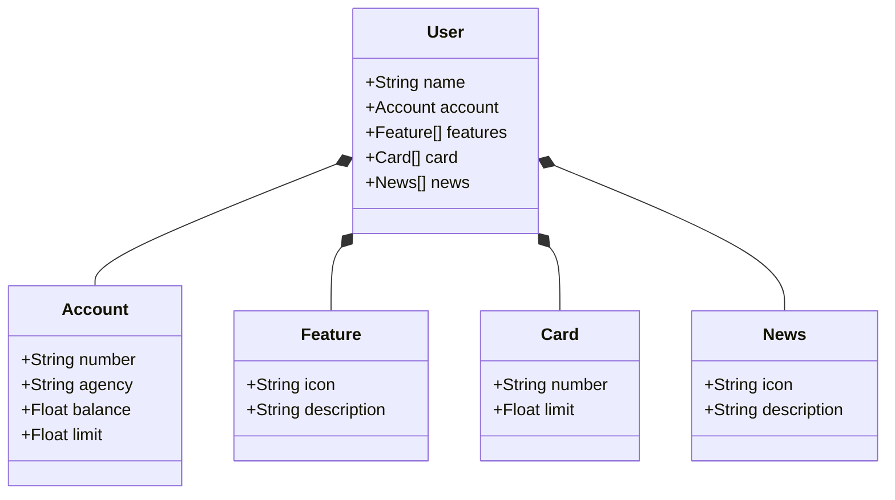

# 🏦 Bradesco Dev Bootcamp – Banking User API

Este projeto faz parte do **Bootcamp Bradesco para Desenvolvedores**, com o objetivo de aplicar na prática os conhecimentos adquiridos na construção de APIs modernas, seguras e preparadas para produção.

A aplicação simula um sistema bancário básico com gerenciamento de usuários, contas, cartões, notícias e funcionalidades específicas, refletindo uma estrutura real de serviços financeiros.

---

## 📌 Diagrama de Classes

O modelo abaixo representa a estrutura principal da aplicação, baseada em um usuário bancário:

## 🚀 Tecnologias Utilizadas
Este projeto será desenvolvido com um stack robusto e moderno:

Java – Linguagem principal para desenvolvimento backend

Spring Boot – Framework para criação de APIs REST seguras e performáticas

H2 Database – Banco de dados em memória para testes e desenvolvimento

PostgreSQL – Banco de dados relacional para ambiente de produção

JWT (JSON Web Token) – Autenticação segura via token

Cloud Technologies – Estrutura preparada para deploy em nuvem

## 🔐 Segurança
A autenticação dos usuários será baseada em JWT, garantindo integridade, autenticação e segurança no consumo das APIs.

## ☁️ Nuvem
O projeto será preparado para execução em ambiente de nuvem, com foco em escalabilidade e disponibilidade, seguindo boas práticas de DevOps e deploy contínuo.

## 👨‍💻 Objetivo do Projeto
Este repositório representa não apenas um projeto técnico, mas uma jornada de aprendizado com propósito real: aprimorar habilidades práticas e teóricas para atuar no mercado como Desenvolvedor Java, com forte compreensão de APIs bancárias, segurança da informação e arquitetura de software moderna.

## 💼 Bootcamp Bradesco
Projeto integrante do Bootcamp Bradesco para Desenvolvedores, voltado à formação de profissionais preparados para atuar no universo financeiro com tecnologia de ponta.
